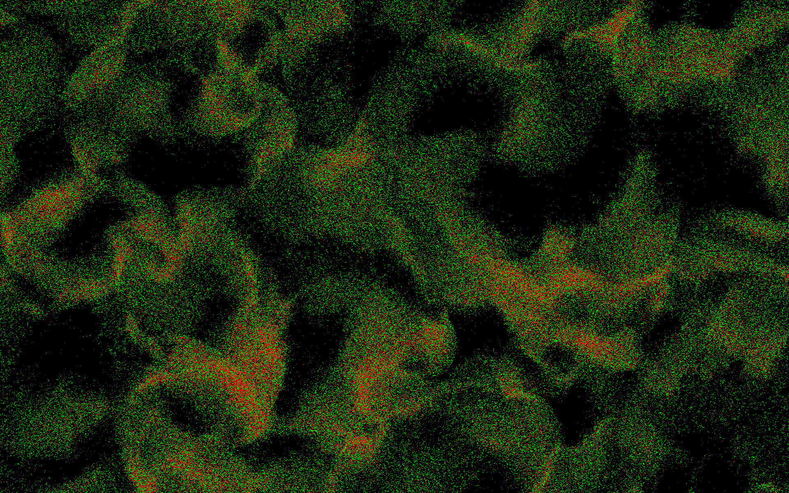

# Boids Simulation - Performance Optimization

This branch of the project focuses on performance optimization, allowing the simulation to handle much larger populations of boids through advanced techniques.  

<p align="center">
  
</p>


## Extension Description  
The optimization is based on two main approaches:  
1. **CUDA Parallelization** : Uses the GPU to perform massively parallel computations, offloading the CPU.  
2. **Spatial Hashing** : Divides the environment into cells, reducing the number of comparisons required for each boid.  

With these techniques, the simulation can handle up to one million boids (depending on GPU) while maintaining smooth visualization.  

## Dependencies  
- **C++11** or later.  
- **[CMake](https://cmake.org/)** : for configuration and build.  
- **[OpenCV](https://opencv.org/)** : for graphical rendering.  
- **[CUDA](https://developer.nvidia.com/cuda-toolkit)** and **NVIDIA GPU** : for GPU acceleration.  

## Installation & Build  
**Clone the repository:** :  
   ```bash
   git clone -b extension-performance https://github.com/Cyclemnt/boids.git
   ```  

**Build and run:** :  
   ```bash
   cd boids
   mkdir build
   cd build
   cmake ..  
   make
   ./main
   ```  
